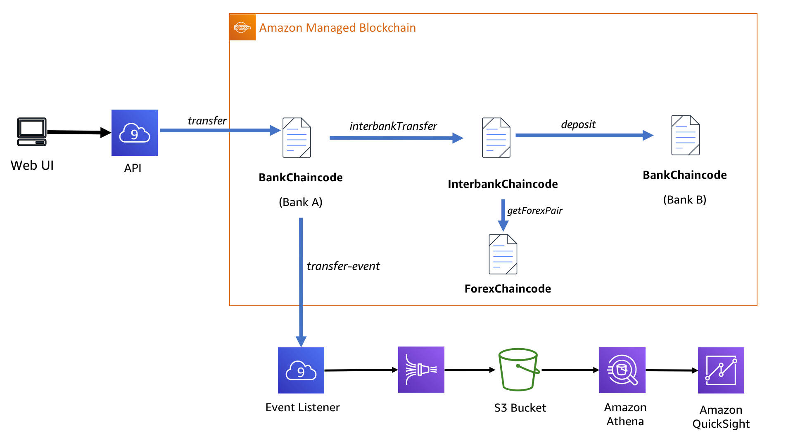
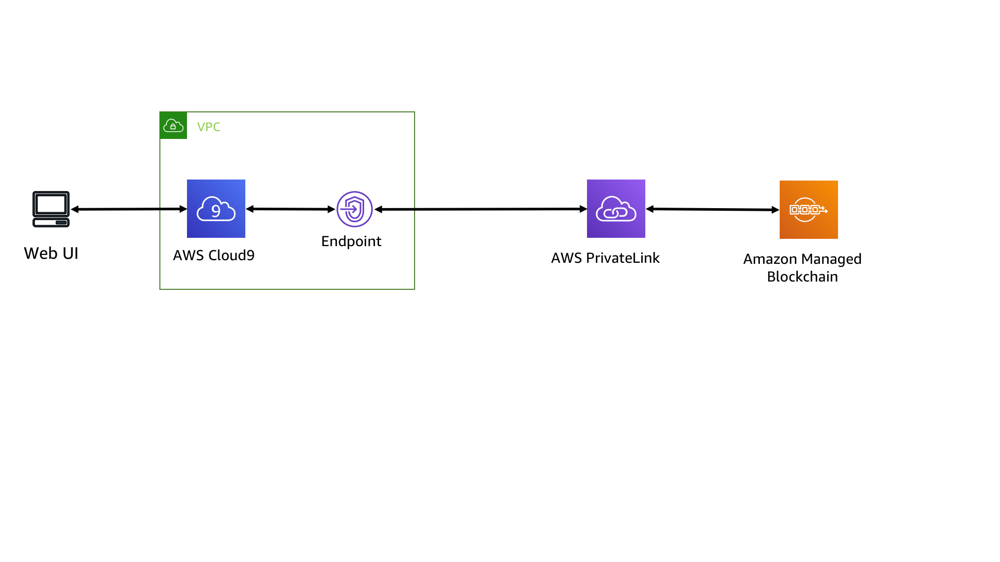
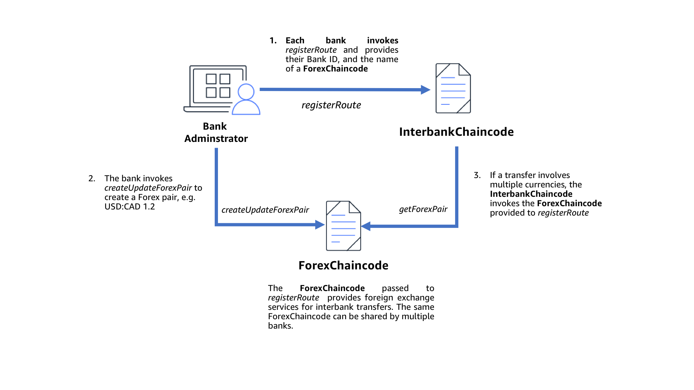
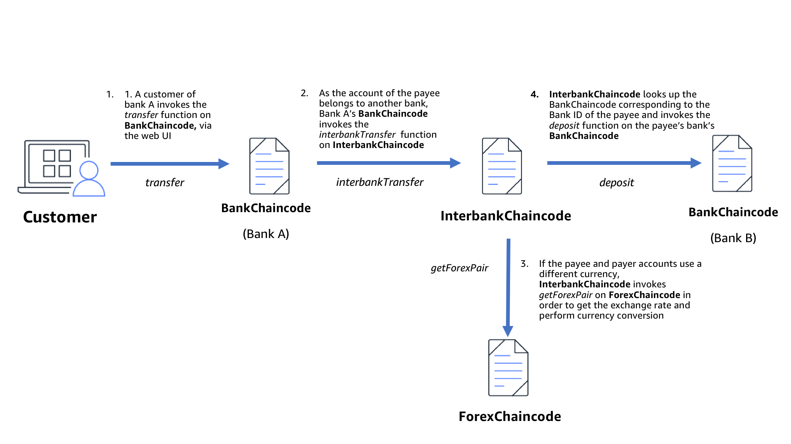
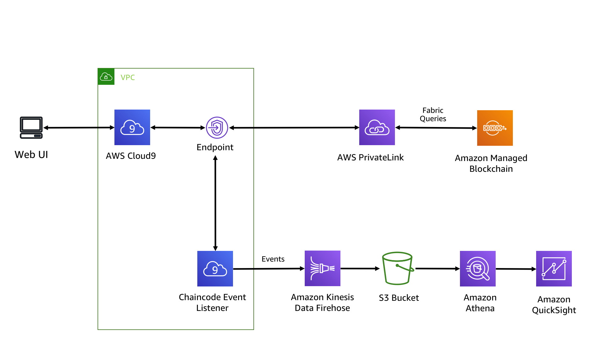
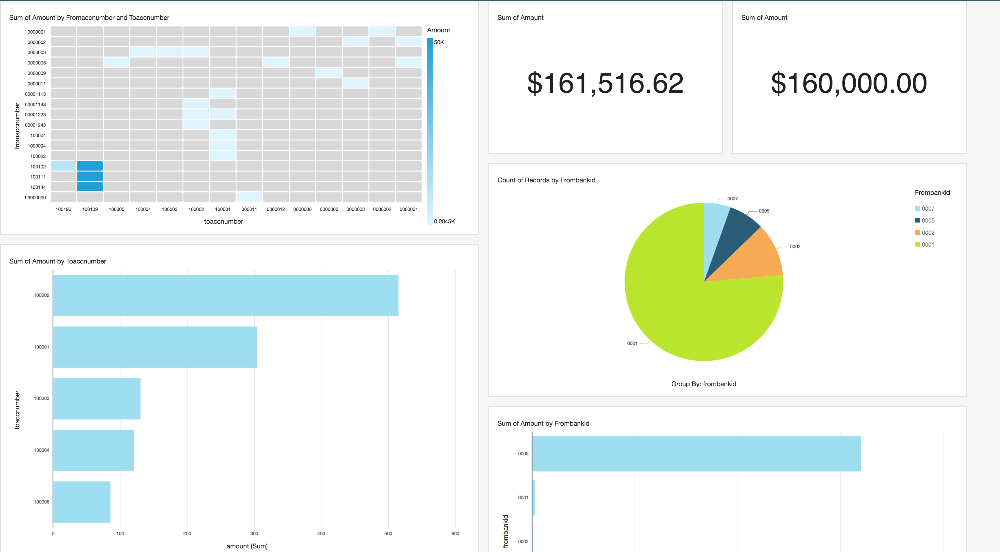

# Build an Interbank Transfer Solution Using Amazon Managed Blockchain

In this workshop we will build an interbank transfer solution using Hyperledger Fabric on Amazon Managed Blockchain. Interbank transfer can be often be a complex challenge involving numerous banks and protocols. As a result it can be slow and opaque. As an alternative to traditional mechanisms such as SWIFT or SEPA, this workshop explores the use of blockchain to facilitate interbank transfer. This has a number of potential benefits including increased speed, transparency, and disintermediation. By the end of this workshop, we will have built out a simplified interbank transfer solution on a blockchain network, and in the process have explored Amazon Managed Blockchain and other AWS services. 

There are Five parts to this workshop. In each part we will deploy:

* Three Fabric chaincode programs which provide banking, currency conversion, and interbank transfer. 
* A REST API and Web App which will interact with our chaincode to provide a simple online banking experience
* An event listener which will listen for chaincode events that we write, and send them to Amazon Kinesis
* An analytics solution for our chaincode events using Amazon Kinesis Analytics, Amazon Athena, and Amazon Quicksight
* Optionally: A shared Fabric channel across multiple workshop participants

This diagram describes this architecture at a high level:



# Part 0 - Prerequisites and Environment Setup

The following are prerequisites for this workshop:
* You have an AWS account, and the ability to log into the AWS account.
* The account must have permissions to the resources that this workshop uses. Some of the AWS services that will be required is Amazon S3, Amazon Managed Blockchain, Amazon Kinesis Data Streams, Amazon Kinesis Data Firehose, and Amazon Athena.  
* An Amazon Managed Blockchain Hyperledger Fabric network in which the AWS account is part of as a member, and a peer within that network.

## Creating a Network, Member and Node

This workshop assumes that you already have an Amazon Managed Blockchain Network, Member, and Node available within your account. If you are participating in this workshop at an AWS sponsored event, the account you are provided with will have these resources. If this is the case, please skip this section and proceed to setting up the Cloud9 environment. 

If your account is not part of a Blockchain Network, this section will go through the process on creating a network, a member for the network and node for the network. The simplest way to provision these resources is in the [Managed Blockchain Console](https://us-east-1.console.aws.amazon.com/managedblockchain/home?region=us-east-1). The process involves the following steps:

1. Create a Blockchain Network with the following parameters:
- Choose Hyperledger Fabric version 1.2
- Under Network Name, please provide a name for the network such as "AmazonManagedBlockchainWorkshop"
- Keep all other fields the same.
- Click on Next
- Enter a member name such as "Bank1"
- For Admin name, enter "admin"
- For Admin password, enter "Admin123". (This will be important later on.)
- Click Next.
2. The network should now provision with a single member. The provisioning of the network could take some time. 
3. Create a Node.
- Once the network has been provisioned, click into the network. On the top tab, click on "Members".
- Click on the Member with the name that you provided in step 1 in the "Members owned by you"
- Click the "Create peer node" button.
- Select "bc.t3.small" as your node instance type. 
- Click on "Create peer node"

You have now provisioned a Blockchain Network with a single Member, and a single node under that member. You can now proceed. 

# Part 1 - Setting Cloud9 Environment

We will use AWS Cloud9 to provide a Linux terminal which has the AWS CLI already installed.

1. Spin up a Cloud9 IDE from the AWS console. In the Cloud9 console, click 'Create Environment'. Using 'us-east-1' for the region will be easier.
2. Provide a name for your environment, e.g. fabric-c9, and click Next Step
3. Select Other instance type, then select t2.medium and click Next Step
4. Click Create environment. It would typically take 30-60s to create your Cloud9 IDE
5. In the Cloud9 terminal, in the home directory, clone this repo:

```bash
cd ~/environment/
git clone https://github.com/aws-samples/bank-transfer-blockchain-reinvent2019-workshop.git
```

We have included two scripts within the Git Repo that will be very helpful in running in this workshop and automates many manual steps. The first script downloads and setups the environment with all the necessary dependencies and tools needed for this workshop. Run the following:

```bash
cd ~
~/environment/bank-transfer-blockchain-reinvent2019-workshop/setup/setup_environment.sh
```

This will take a few minutes.  When it's complete you should see the following:

```
Completed successfully. Please run:
1) source ~/.bash_profile
2) '~/environment/bank-transfer-blockchain-reinvent2019-workshop/setup/setup_fabric_environment.py' to finish setting up this environment.
``` 

Now, you will need to import your bash profile to get updated paths, and variables. 

```bash
source ~/.bash_profile
```

Now, you should run a second script that will setup the environment for your Blockchain network. Run the following script:

```bash
cd ~/environment/
./bank-transfer-blockchain-reinvent2019-workshop/setup/setup_fabric_environment.py 
``` 

You will be asked a series of questions. Select the network, member and node that you have available to you. The script will then go and setup a few things:
1. A ~/fabric_exports file that contains environment variables that hold information about your network.
2. An admin certificate will be created for you so that you can sign requests sent to the network. 
3. Helper scripts in ~/bin/ location. 
4. We will create and setup the VPC Endpoint so that your VPC can communicate to the Blockchain network. The script will also update security groups as necessary, and add any additional rules to ensure that your Cloud9 instance can communicate with the network.
5. Copy public certificates to S3 so that if you choose to do the multi-member section, all other members can easily access the certificates. 

```bash
source ~/fabric_exports
```

Through this initial setup, this is what we have deployed: 



Now that we have a Amazon Managed Blockchain Network and a Cloud9 notebook configured to interact with Fabric, we can start to deploy
chaincode.

# Part 2 - Deploy Chaincode on a Private Channel 

When logged in to your AWS account, with your environment setup as per the instructions above, the first step iss to provision a channel that is shared across the members of the network.  A channel is a construct in Hyperledger Fabric that enables private communication between a subset of members. Each transaction on the network is executed on a channel.

In this part, we are going to perform the following actions:
1. Create a Private Channel Configuration file and create the first block on the channel's blockchain.
2. We are going to ask our peer node and orderer node to create a channel using the configuration we just created.
3. Join our peer node to the channel so that it can interact with channel and get transactions from the orderer.
4. Install and instantiate chaincode (aka smart contract) onto the channel representing a Bank, a Foriegn Exchange provider (aka Forex provider), and an Interbank transfer provider. 
5. Create accounts within our Bank chaincode and query them.
5. Upgrade chaincode.

### Open Your Cloud9 Instance and Check your Environment Variables

Ensure your environment is set up correctly. Check that your environment variables are set with the details of the network:

```bash
echo $MEMBERID
echo $NETWORKID
```

You can check the full set of environment variables in ~/bash_profile and ~/fabric_exports

### Create Private Channel Configuration

Give your channel a unique name without spaces. It must be unique amongst the network members:

```
export CHANNEL=<UNIQUE CHANNEL NAME>
```

Update the configtx channel configuration. This file configures how a channel is created. The Name and ID fields should be updated with the member ID from Managed Blockchain.

```bash
cp ~/environment/bank-transfer-blockchain-reinvent2019-workshop/setup/private-configtx.yaml ~/configtx.yaml
sed -i "s|__MEMBERID__|$MEMBERID|g" ~/configtx.yaml
```

Generate the configtx channel configuration by executing the following script. When the channel is created, this channel configuration will become the genesis block (i.e. block 0) on the channel:

```bash
docker exec cli configtxgen -outputCreateChannelTx /opt/home/$CHANNEL.pb -profile OneOrgChannel -channelID $CHANNEL --configPath /opt/home/
```

You should see the following output:

```
2019-11-20 23:34:56.190 UTC [common/tools/configtxgen] doOutputChannelCreateTx -> INFO 005 Writing new channel tx
```
### Create a Channel

Run the following command to create a channel using the variables that you established and the configtx peer block that you created: 

```bash
docker exec -e "CORE_PEER_TLS_ENABLED=true" \
-e "CORE_PEER_TLS_ROOTCERT_FILE=/opt/home/managedblockchain-tls-chain.pem" \
-e "CORE_PEER_ADDRESS=$PEER" \
-e "CORE_PEER_LOCALMSPID=$MSP" \
-e "CORE_PEER_MSPCONFIGPATH=$MSP_PATH" \
cli peer channel create -c $CHANNEL \
-f /opt/home/$CHANNEL.pb -o $ORDERER \
--cafile /opt/home/managedblockchain-tls-chain.pem --tls
```

You should see output which resembles the following:
```bash
2019-11-23 18:58:38.801 UTC [channelCmd] InitCmdFactory -> INFO 01b Endorser and orderer connections initialized
2019-11-23 18:58:39.003 UTC [cli/common] readBlock -> INFO 01c Got status: &{NOT_FOUND}
2019-11-23 18:58:39.014 UTC [channelCmd] InitCmdFactory -> INFO 01d Endorser and orderer connections initialized
2019-11-23 18:58:39.216 UTC [cli/common] readBlock -> INFO 01e Got status: &{NOT_FOUND}
2019-11-23 18:58:39.228 UTC [channelCmd] InitCmdFactory -> INFO 01f Endorser and orderer connections initialized
2019-11-23 18:58:39.430 UTC [cli/common] readBlock -> INFO 020 Got status: &{NOT_FOUND}
2019-11-23 18:58:39.444 UTC [channelCmd] InitCmdFactory -> INFO 021 Endorser and orderer connections initialized
2019-11-23 18:58:39.650 UTC [cli/common] readBlock -> INFO 022 Received block: 0
```

### Join Your Peer to the Channel

```bash
docker exec -e "CORE_PEER_TLS_ENABLED=true" \
-e "CORE_PEER_TLS_ROOTCERT_FILE=/opt/home/managedblockchain-tls-chain.pem" \
-e "CORE_PEER_ADDRESS=$PEER" \
-e "CORE_PEER_LOCALMSPID=$MSP" \
-e "CORE_PEER_MSPCONFIGPATH=$MSP_PATH" \
cli peer channel join -b $CHANNEL.block \
-o $ORDERER --cafile /opt/home/managedblockchain-tls-chain.pem --tls
```

You should see output resembling the following, which indicates that your peer has joined the channel:

```
2019-11-23 19:11:22.708 UTC [channelCmd] InitCmdFactory -> INFO 001 Endorser and orderer connections initialized
2019-11-23 19:11:22.937 UTC [channelCmd] executeJoin -> INFO 002 Successfully submitted proposal to join channel
```

### Deploying Chaincode
Now that we have a channel set up between our members we can now deploy chaincode to that channel.

Chaincode is a program written in Go, Node, or Java which implements a standard interface and
executes on Fabric peers. Chaincode manages state within the ledger and exposes functions which can be invoked by external
processes. In this first part of this workshop we will deploy three chaincode programs that will
provide functionality for managing banks, bank accounts, foreign exchange, and transfers. To read
more about the design of the chaincode used in this workshop please refer to the [ChaincodeOverview.md.](./ChaincodeOverview.md).


### Copy Chaincode to GOPATH

To get started, copy the chaincode from the chaincode/src folder in the repository, to the GOPATH:

```bash
cp -r ~/environment/bank-transfer-blockchain-reinvent2019-workshop/chaincode/* ~/go/
```

### Add a Symlink to GOPATH

In order to be able to easily modify files in the built in Cloud9 editor, create a symlink to ~/go in the environment directory:

```bash
cd ~/environment/
ln -s ~/go
```

You will now see ~/go in the environment file list on the left side of Cloud9.

### Download Dependencies

Download the dependencies for the chaincode.

```bash
cd ~/go/src/bank
go get -t 
```

### Deploy the Bank Chaincode

The first chaincode that we will deploy in BankChaincode. This is the primary chaincode that we will interact with and is the chaincode that invokes functions from the other two chaincode programs in this workshop. 

### Set $BANKCHAINCODENAME to the name of your bank

Set the $BANKCHAINCODENAME variable to the name of your fictional bank, without spaces or caps. And then set $FOREXCHAINCODENAME.

```bash
export BANKCHAINCODENAME=<YOUR FICTIONAL BANK NAME>
export FOREXCHAINCODENAME=$BANKCHAINCODENAME-forex
```

Add this export to either your .bashrc or ~/fabric_exports file in order to avoid having to reset it if you open a new terminal session.

### Install the Chaincode on the Peer
```bash
docker exec -e "CORE_PEER_TLS_ENABLED=true" \
-e "CORE_PEER_TLS_ROOTCERT_FILE=/opt/home/managedblockchain-tls-chain.pem"  \
-e "CORE_PEER_LOCALMSPID=$MSP" \
-e "CORE_PEER_MSPCONFIGPATH=$MSP_PATH"  \
-e "CORE_PEER_ADDRESS=$PEER" \
cli peer chaincode install -n $BANKCHAINCODENAME -v v0 -p bank/cmd  
```

You should see output which resembles the following: 

```bash
2019-11-23 18:54:01.948 UTC [chaincodeCmd] install -> INFO 003 Installed remotely response:<status:200 payload:"OK" > 
```

This indicates that the Chaincode has been installed and is ready to be instantiated. 

### Instantiate the Bank Chaincode
```bash
docker exec -e "CORE_PEER_TLS_ENABLED=true" \
-e "CORE_PEER_TLS_ROOTCERT_FILE=/opt/home/managedblockchain-tls-chain.pem"  \
-e "CORE_PEER_LOCALMSPID=$MSP" \
-e "CORE_PEER_MSPCONFIGPATH=$MSP_PATH"  \
-e "CORE_PEER_ADDRESS=$PEER" \
cli peer chaincode instantiate -o $ORDERER -C $CHANNEL -n $BANKCHAINCODENAME -v v0 -c '{"Args":["The Royal Bank of Cloud", "0001", "'$FOREXCHAINCODENAME'"]}' --cafile /opt/home/managedblockchain-tls-chain.pem --tls       
```

### Create a New Account (Invoke Chaincode)

Now we have the chaincode installed and instantiated we can invoke it. The createAccount function takes four arguments: the name of the account holder, the account number, the balance of the account, and the currency used by the account (as a three letter currency symbol). Let's create a new bank account with account number 0000001 and 50 USD balance. 
```bash
docker exec -e "CORE_PEER_TLS_ENABLED=true" \
-e "CORE_PEER_TLS_ROOTCERT_FILE=/opt/home/managedblockchain-tls-chain.pem"  \
-e "CORE_PEER_LOCALMSPID=$MSP" \
-e "CORE_PEER_MSPCONFIGPATH=$MSP_PATH"  \
-e "CORE_PEER_ADDRESS=$PEER" \
cli peer chaincode invoke  -C $CHANNEL -n $BANKCHAINCODENAME -c '{"Args":["createAccount", "Jonathan Shapiro-Ward", "0000001", "500000", "USD"]}' --cafile /opt/home/managedblockchain-tls-chain.pem --tls  
```

You should see a response that resembles the following:

```
2019-11-21 00:21:09.408 UTC [chaincodeCmd] chaincodeInvokeOrQuery -> INFO 002 Chaincode invoke successful. result: status:200 
```
### Query that Account (Query Chaincode)
Next query that account, and we will get back our account details. 
```bash
docker exec -e "CORE_PEER_TLS_ENABLED=true" \
-e "CORE_PEER_TLS_ROOTCERT_FILE=/opt/home/managedblockchain-tls-chain.pem"  \
-e "CORE_PEER_LOCALMSPID=$MSP" \
-e "CORE_PEER_MSPCONFIGPATH=$MSP_PATH"  \
-e "CORE_PEER_ADDRESS=$PEER" \
cli peer chaincode invoke  -C $CHANNEL -n $BANKCHAINCODENAME -c '{"Args":["queryAccount", "0000001"]}' --cafile /opt/home/managedblockchain-tls-chain.pem --tls  
```

You should see the following response:

```
2019-11-21 00:22:29.466 UTC [chaincodeCmd] chaincodeInvokeOrQuery -> INFO 002 Chaincode invoke successful. result: status:200 payload:"{\"name\":\"Jonathan Shapiro-Ward\",\"id\":\"0000001\",\"balance\":\"500000\",\"currency\":\"USD\",\"lastTranfer\":{\"amount\":\"0\",\"fromAccc\":\"\",\"fromBank\":\"\",\"toAcc\":\"\"}}" 
```

### Create a Second Account
Let's create a second account. This time with account number 0000002 and 0 USD balance. 
```bash
docker exec -e "CORE_PEER_TLS_ENABLED=true" \
-e "CORE_PEER_TLS_ROOTCERT_FILE=/opt/home/managedblockchain-tls-chain.pem"  \
-e "CORE_PEER_LOCALMSPID=$MSP" \
-e "CORE_PEER_MSPCONFIGPATH=$MSP_PATH"  \
-e "CORE_PEER_ADDRESS=$PEER" \
cli peer chaincode invoke  -C $CHANNEL -n $BANKCHAINCODENAME -c '{"Args":["createAccount", "Joe Smith", "0000002", "10", "USD"]}' --cafile /opt/home/managedblockchain-tls-chain.pem --tls  
```

### Transfer Between Accounts
Now, let's perform an intra-bank transfer between accounts

```bash
docker exec -e "CORE_PEER_TLS_ENABLED=true" \
-e "CORE_PEER_TLS_ROOTCERT_FILE=/opt/home/managedblockchain-tls-chain.pem"  \
-e "CORE_PEER_LOCALMSPID=$MSP" \
-e "CORE_PEER_MSPCONFIGPATH=$MSP_PATH"  \
-e "CORE_PEER_ADDRESS=$PEER" \
cli peer chaincode invoke -C $CHANNEL -n $BANKCHAINCODENAME -c '{"Args":["transfer", "0000001", "0001", "0000002", "10"]}' --cafile /opt/home/managedblockchain-tls-chain.pem --tls  
```

### Query account 0000002 and confirm the transfer was successful
```bash
docker exec -e "CORE_PEER_TLS_ENABLED=true" \
-e "CORE_PEER_TLS_ROOTCERT_FILE=/opt/home/managedblockchain-tls-chain.pem"  \
-e "CORE_PEER_LOCALMSPID=$MSP" \
-e "CORE_PEER_MSPCONFIGPATH=$MSP_PATH"  \
-e "CORE_PEER_ADDRESS=$PEER" \
cli peer chaincode invoke  -C $CHANNEL -n $BANKCHAINCODENAME -c '{"Args":["queryAccount", "0000002"]}' --cafile /opt/home/managedblockchain-tls-chain.pem --tls  
```

You should see the following (note the balance is 20 now):

```bash
2019-11-27 02:06:13.149 UTC [chaincodeCmd] chaincodeInvokeOrQuery -> INFO 002 Chaincode invoke successful. result: status:200 payload:"{\"name\":\"Joe Smith\",\"id\":\"0000002\",\"balance\":\"20\",\"currency\":\"USD\"}" 
```

### Examine the Historical State of an Account

By performing a transfer, we have modified the ledger to store a new balance for each account. We can examine the historical state of the ledger and examine how the account was changed. To do so, execute the getTransactionHistory function:

```bash
docker exec -e "CORE_PEER_TLS_ENABLED=true" \
-e "CORE_PEER_TLS_ROOTCERT_FILE=/opt/home/managedblockchain-tls-chain.pem"  \
-e "CORE_PEER_LOCALMSPID=$MSP" \
-e "CORE_PEER_MSPCONFIGPATH=$MSP_PATH"  \
-e "CORE_PEER_ADDRESS=$PEER" \
cli peer chaincode invoke -C $CHANNEL -n $BANKCHAINCODENAME -c '{"Args":["getTransactionHistory", "0000001"]}' --cafile /opt/home/managedblockchain-tls-chain.pem --tls  
```

You should see something like the following:
```
2019-11-21 00:29:02.431 UTC [chaincodeCmd] chaincodeInvokeOrQuery -> INFO 002 Chaincode invoke successful. result: status:200 payload:"[{\"Timestamp\":\"seconds:1574295669 nanos:357673108 \", \"Record\":{\"name\":\"Jonathan Shapiro-Ward\",\"id\":\"0000001\",\"balance\":\"50\",\"currency\":\"USD\"}}},{\"Timestamp\":\"seconds:1574295864 nanos:142681742 \", \"Record\":{\"name\":\"Jonathan Shapiro-Ward\",\"id\":\"0000001\",\"balance\":\"40\",\"currency\":\"USD\"}}}" 
```
### Foreign Exchange and Interbank Transfer

If we create a third account with a different currency symbol and attempt a transfer, this will fail with the error: "no forex contract is provided, unable to complete transaction". Likewise if we try to make a payment to an institution with a different bank ID, that payment will fail with: "Unable to perform interbank transfer - no interbankchaincode provided". This is because we have only installed the BankChaincode and the ability to do foreign exchange and interbank transfer are provided by two more contracts. Let's look at those contracts now. 

The following diagram describes the interaction of the InterbankChaincode and ForexChaincode:




### Install the ForexChaincode

Next, install the chaincode:

```bash
docker exec -e "CORE_PEER_TLS_ENABLED=true" \
-e "CORE_PEER_TLS_ROOTCERT_FILE=/opt/home/managedblockchain-tls-chain.pem"  \
-e "CORE_PEER_LOCALMSPID=$MSP" \
-e "CORE_PEER_MSPCONFIGPATH=$MSP_PATH"  \
-e "CORE_PEER_ADDRESS=$PEER" \
cli peer chaincode install -n $FOREXCHAINCODENAME -v v0 -p forex/cmd
```

### Initialize the ForexChaincode
```bash
docker exec -e "CORE_PEER_TLS_ENABLED=true" \
-e "CORE_PEER_TLS_ROOTCERT_FILE=/opt/home/managedblockchain-tls-chain.pem"  \
-e "CORE_PEER_LOCALMSPID=$MSP" \
-e "CORE_PEER_MSPCONFIGPATH=$MSP_PATH"  \
-e "CORE_PEER_ADDRESS=$PEER" \
cli peer chaincode instantiate -o $ORDERER -C $CHANNEL -n $FOREXCHAINCODENAME -v v0 -c '{"Args":[]}'  --cafile /opt/home/managedblockchain-tls-chain.pem --tls 
```

### Make a Forex Pair for USD to GBP

Next, we can invoke createUpdateForexPair to create an exchange rate for USD to GBP:

```bash
docker exec -e "CORE_PEER_TLS_ENABLED=true" \
-e "CORE_PEER_TLS_ROOTCERT_FILE=/opt/home/managedblockchain-tls-chain.pem"  \
-e "CORE_PEER_LOCALMSPID=$MSP" \
-e "CORE_PEER_MSPCONFIGPATH=$MSP_PATH"  \
-e "CORE_PEER_ADDRESS=$PEER" \
cli peer chaincode invoke -o $ORDERER -C $CHANNEL -n $FOREXCHAINCODENAME -c '{"Args":["createUpdateForexPair", "USD", "GBP", "0.8"]}' --cafile $CAFILE --tls
```

### Query the Pair
```bash
docker exec -e "CORE_PEER_TLS_ENABLED=true" \
-e "CORE_PEER_TLS_ROOTCERT_FILE=/opt/home/managedblockchain-tls-chain.pem"  \
-e "CORE_PEER_LOCALMSPID=$MSP" \
-e "CORE_PEER_MSPCONFIGPATH=$MSP_PATH"  \
-e "CORE_PEER_ADDRESS=$PEER" \
cli peer chaincode query -C $CHANNEL -n $FOREXCHAINCODENAME -c '{"Args":["getForexPair","USD", "GBP"]}' 
```

You should see the following:
```
{"pair":"USD:GBP","rate":0.8}
```

### Perform Transfers
Now that we have an exchange rate set up for USD to GBP. We can perform transfers between accounts in different currencies. Create a third account with a different currency symbol. Create a Forex Pair matching the currencies and then perform a transfer. 

First, we will create a new account for Lisa Simpson in which her account is in GBP currency with 50 GBP as her account balance:

```bash
docker exec -e "CORE_PEER_TLS_ENABLED=true" \
-e "CORE_PEER_TLS_ROOTCERT_FILE=/opt/home/managedblockchain-tls-chain.pem"  \
-e "CORE_PEER_LOCALMSPID=$MSP" \
-e "CORE_PEER_MSPCONFIGPATH=$MSP_PATH"  \
-e "CORE_PEER_ADDRESS=$PEER" \
cli peer chaincode invoke  -C $CHANNEL -n $BANKCHAINCODENAME -c '{"Args":["createAccount", "Lisa Simpson", "0000003", "50", "GBP"]}' --cafile /opt/home/managedblockchain-tls-chain.pem --tls  
```

And now, lets transfer 10 USD from Joe to Lisa in which the Forex will convert it to 8 GBP as the exchange rate is 1 USD to 0.8 GBP.

```bash
docker exec -e "CORE_PEER_TLS_ENABLED=true" \
-e "CORE_PEER_TLS_ROOTCERT_FILE=/opt/home/managedblockchain-tls-chain.pem"  \
-e "CORE_PEER_LOCALMSPID=$MSP" \
-e "CORE_PEER_MSPCONFIGPATH=$MSP_PATH"  \
-e "CORE_PEER_ADDRESS=$PEER" \
cli peer chaincode invoke -C $CHANNEL -n $BANKCHAINCODENAME -c '{"Args":["transfer", "0000002", "0001", "0000003", "10"]}' --cafile /opt/home/managedblockchain-tls-chain.pem --tls  
```

Now lets check that the transfer occurred by querying Lisa's account:

```bash
docker exec -e "CORE_PEER_TLS_ENABLED=true" \
-e "CORE_PEER_TLS_ROOTCERT_FILE=/opt/home/managedblockchain-tls-chain.pem"  \
-e "CORE_PEER_LOCALMSPID=$MSP" \
-e "CORE_PEER_MSPCONFIGPATH=$MSP_PATH"  \
-e "CORE_PEER_ADDRESS=$PEER" \
cli peer chaincode invoke  -C $CHANNEL -n $BANKCHAINCODENAME -c '{"Args":["queryAccount", "0000003"]}' --cafile /opt/home/managedblockchain-tls-chain.pem --tls  
```

You should see that Lisa's account should have 58 GBP:

```bash
2019-11-27 15:10:17.759 UTC [chaincodeCmd] chaincodeInvokeOrQuery -> INFO 002 Chaincode invoke successful. result: status:200 payload:"{\"name\":\"Lisa Simpson\",\"id\":\"0000003\",\"balance\":\"58\",\"currency\":\"GBP\"}" 
```

## Interbank Transfer

The follow diagram demonstrates the interaction of chaincode to provide an interbank transfer:




###  Set INTENRBANKCHAINCODENAME.

```bash
export INTENRBANKCHAINCODENAME=$BANKCHAINCODENAME-interbank
```

Add this export to either your .bashrc or ~/fabric_exports file in order to avoid having to reset it if you open a new terminal session.


##  (Advanced, Optional) - Implement Interbank Transfer

Examine interbank.go within the interbank folder. This chaincode acts a router between different banks. The BankChaincode sending the account invokes the interbankTransfer function of the InterbankChaincode. The transfer function looks up the Bank ID of the receiving bank on the ledger, if it finds a record it retrieves the name of the receiving bank's chaincode from that record, it subsequently invokes the deposit function of the receiving BankChaincode. 

The transfer function resides in bank/transfer.go. The function does a number of things: first it validates inputs, next it checks if the transfer is between banks, if it isn't it performs and intrabank transfer with optional currency exchange. However, if you attempt an interbank transfer, the Chaincode will fail. The logic is not yet implemented. 

In order to perform an interbank transfer, we must do two things:
* Invoke the interbankTransfer function on InterbankChaincode, providing the account number of the payee, the bank ID of the receiving bank, and the currency symbol of the payer account. 
* Deduct the funds from the payer account

For an example of how to invoke an external chaincode from within our function we can examine the curencyConversion helper function from transfer.go. This function takes three arguments: a ForexContract, a base currency symbol, and a counter currency symbol. It then invokes getForexPair on the ForexContract using the two currency symbols. 

Implement interbank transfer within the transfer method and then upgrade the chaincode. Optionally, a completed solution is available in the solution folder.

You can test your solution using the provided transfer_test.go test file using the command from within the bank directory:

```bash
go test
```

Note that it is the chaincode in ~/go/src/bank that is used when we deploy Chaincode to Fabric, not the chaincode in the git repo. If you added a symlimk earlier you can edit code in the ~/go/src/bank folder by navigating it in sidebar in Cloud9. 

If you prefer to use the provided solution and skip implementing your own transfer function, run:

```
cp ~/environment/bank-transfer-blockchain-reinvent2019-workshop/solution/transfer.go ~/go/src/bank/transfer.go
```

This will overwrite the existing chaincode with a complete solution. 

## Upgrade the BankChaincode

Regardless of whether you wrote the transfer method or if you used the provided solution we need to upgrade the chaincode to use the new code.

If you skipped above and have not yet copied the pre-made solution, please do so now by running:

```bash
cp ~/environment/bank-transfer-blockchain-reinvent2019-workshop/solution/transfer.go ~/go/src/bank/transfer.go
```

To do this, install a new version. Note the version is now v1:

```bash
docker exec -e "CORE_PEER_TLS_ENABLED=true" \
-e "CORE_PEER_TLS_ROOTCERT_FILE=/opt/home/managedblockchain-tls-chain.pem"  \
-e "CORE_PEER_LOCALMSPID=$MSP" \
-e "CORE_PEER_MSPCONFIGPATH=$MSP_PATH" \
-e "CORE_PEER_ADDRESS=$PEER" \
cli peer chaincode install -n $BANKCHAINCODENAME -v v1 -p bank/cmd  
```

Now, let's upgrade the chaincode:

```bash
docker exec -e "CORE_PEER_TLS_ENABLED=true" \
-e "CORE_PEER_TLS_ROOTCERT_FILE=/opt/home/managedblockchain-tls-chain.pem"  \
-e "CORE_PEER_LOCALMSPID=$MSP" \
-e "CORE_PEER_MSPCONFIGPATH=$MSP_PATH" \
-e "CORE_PEER_ADDRESS=$PEER" \
cli peer chaincode upgrade -o $ORDERER -C $CHANNEL -n $BANKCHAINCODENAME -v v1 -c '{"Args":["The Royal Bank of Cloud", "0001", "'$FOREXCHAINCODENAME'", "'$INTENRBANKCHAINCODENAME'"]}' --cafile /opt/home/managedblockchain-tls-chain.pem --tls 
```

### Deploy the InterbankChaincode


### Install the chaincode on the peer

```bash
docker exec -e "CORE_PEER_TLS_ENABLED=true" \
-e "CORE_PEER_TLS_ROOTCERT_FILE=/opt/home/managedblockchain-tls-chain.pem"  \
-e "CORE_PEER_LOCALMSPID=$MSP" \
-e "CORE_PEER_MSPCONFIGPATH=$MSP_PATH"  \
-e "CORE_PEER_ADDRESS=$PEER" \
cli peer chaincode install -n $INTENRBANKCHAINCODENAME -v v0 -p interbank/cmd
```

### Instantiate the Chaincode

```bash 
docker exec -e "CORE_PEER_TLS_ENABLED=true" \
-e "CORE_PEER_TLS_ROOTCERT_FILE=/opt/home/managedblockchain-tls-chain.pem"  \
-e "CORE_PEER_LOCALMSPID=$MSP" \
-e "CORE_PEER_MSPCONFIGPATH=$MSP_PATH"  \
-e "CORE_PEER_ADDRESS=$PEER" \
cli peer chaincode instantiate -n $INTENRBANKCHAINCODENAME -v v0 -C $CHANNEL -c '{"Args":[]}' --cafile /opt/home/managedblockchain-tls-chain.pem --tls     
```


### Create a Second Bank

Now, create a second bank. This time, we create a bank with two extra parameters: $FOREXCHAINCODENAME and $INTENRBANKCHAINCODENAME. This enables this new bank to perform foreign exchange and interbank transfer. Replace "<FICTIONAL BANK NAME 2>" with a name that is unique, and without spaces. 

```
export SECONDBANKCHAINCODENAME=<FICTIONAL BANK NAME 2>
```

To use the BankChaincode a second time, we have to install it under a different name.

```bash
docker exec -e "CORE_PEER_TLS_ENABLED=true" \
-e "CORE_PEER_TLS_ROOTCERT_FILE=/opt/home/managedblockchain-tls-chain.pem"  \
-e "CORE_PEER_LOCALMSPID=$MSP" \
-e "CORE_PEER_MSPCONFIGPATH=$MSP_PATH"  \
-e "CORE_PEER_ADDRESS=$PEER" \
cli peer chaincode install -n $SECONDBANKCHAINCODENAME -v v0 -p bank/cmd  
```

And instantiate the chaincode:

```bash
docker exec -e "CORE_PEER_TLS_ENABLED=true" \
-e "CORE_PEER_TLS_ROOTCERT_FILE=/opt/home/managedblockchain-tls-chain.pem"  \
-e "CORE_PEER_LOCALMSPID=$MSP" \
-e "CORE_PEER_MSPCONFIGPATH=$MSP_PATH" \
-e "CORE_PEER_ADDRESS=$PEER" \
cli peer chaincode instantiate -o $ORDERER -C $CHANNEL -n $SECONDBANKCHAINCODENAME -v v0 -c '{"Args":["The Internet Bank", "0005", "'$FOREXCHAINCODENAME'", "'$INTENRBANKCHAINCODENAME'"]}' --cafile /opt/home/managedblockchain-tls-chain.pem --tls       
```

### Create a New Account on this new Bank

```bash
docker exec -e "CORE_PEER_TLS_ENABLED=true" \
-e "CORE_PEER_TLS_ROOTCERT_FILE=/opt/home/managedblockchain-tls-chain.pem"  \
-e "CORE_PEER_LOCALMSPID=$MSP" \
-e "CORE_PEER_MSPCONFIGPATH=$MSP_PATH" \
-e "CORE_PEER_ADDRESS=$PEER" \
cli peer chaincode invoke  -C $CHANNEL -n $SECONDBANKCHAINCODENAME -c '{"Args":["createAccount", "Mert Hocanin", "101010", "5000", "USD"]}' --cafile /opt/home/managedblockchain-tls-chain.pem --tls  
```

### Register a Route To Each of Your Banks

Now that the InterbankChaincode is deployed, we have a mechanism to transfer funds between banks. Before we can use it, we have to register a route with the InterbankChaincode. This is a callback that allows the InterbankChaincode to invoke the deposit function on your BankChaincode.


First we register a route from bank ID 0001 to $BANKCHAINCODENAME.
```bash
docker exec -e "CORE_PEER_TLS_ENABLED=true" \
-e "CORE_PEER_TLS_ROOTCERT_FILE=/opt/home/managedblockchain-tls-chain.pem"  \
-e "CORE_PEER_LOCALMSPID=$MSP" \
-e "CORE_PEER_MSPCONFIGPATH=$MSP_PATH" \
-e "CORE_PEER_ADDRESS=$PEER" \
cli peer chaincode invoke -n $INTENRBANKCHAINCODENAME  -C $CHANNEL -c '{"Args":["registerRoute", "0001","'$BANKCHAINCODENAME'", "'$FOREXCHAINCODENAME'"]}' --cafile /opt/home/managedblockchain-tls-chain.pem --tls   
```

Next we route from 005 to $SECONDBANKCHAINCODENAME.

```bash
docker exec -e "CORE_PEER_TLS_ENABLED=true" \
-e "CORE_PEER_TLS_ROOTCERT_FILE=/opt/home/managedblockchain-tls-chain.pem"  \
-e "CORE_PEER_LOCALMSPID=$MSP" \
-e "CORE_PEER_MSPCONFIGPATH=$MSP_PATH" \
-e "CORE_PEER_ADDRESS=$PEER" \
cli peer chaincode invoke -n $INTENRBANKCHAINCODENAME  -C $CHANNEL -c '{"Args":["registerRoute", "0005","'$SECONDBANKCHAINCODENAME'", "'$FOREXCHAINCODENAME'"]}' --cafile /opt/home/managedblockchain-tls-chain.pem --tls   
```
## Perform an Interbank Transfer

Now, perform a transfer. This time, pay to an account belonging to to your second bank. For example:

```bash
docker exec -e "CORE_PEER_TLS_ENABLED=true" \
-e "CORE_PEER_TLS_ROOTCERT_FILE=/opt/home/managedblockchain-tls-chain.pem" \
-e "CORE_PEER_ADDRESS=$PEER" \
-e "CORE_PEER_LOCALMSPID=$MSP" \
-e "CORE_PEER_MSPCONFIGPATH=$MSP_PATH" \
cli peer chaincode invoke -C $CHANNEL -n $SECONDBANKCHAINCODENAME -c '{"Args":["transfer", "101010", "0001", "0000001", "1"]}' --cafile /opt/home/managedblockchain-tls-chain.pem --tls  
```

Examine the history of account 0000001 again, and you will see the transfers:

```bash
docker exec -e "CORE_PEER_TLS_ENABLED=true" \
-e "CORE_PEER_TLS_ROOTCERT_FILE=/opt/home/managedblockchain-tls-chain.pem"  \
-e "CORE_PEER_LOCALMSPID=$MSP" \
-e "CORE_PEER_MSPCONFIGPATH=$MSP_PATH"  \
-e "CORE_PEER_ADDRESS=$PEER" \
cli peer chaincode invoke -C $CHANNEL -n $BANKCHAINCODENAME -c '{"Args":["getTransactionHistory", "0000001"]}' --cafile /opt/home/managedblockchain-tls-chain.pem --tls  
```

Next, let's do it the other way around. This time transferring from account  0000001 on bank 0001 to account 101010 on bank 0005.

```bash
docker exec -e "CORE_PEER_TLS_ENABLED=true" \
-e "CORE_PEER_TLS_ROOTCERT_FILE=/opt/home/managedblockchain-tls-chain.pem"     \
-e "CORE_PEER_ADDRESS=$PEER" \
-e "CORE_PEER_LOCALMSPID=$MSP" \
-e "CORE_PEER_MSPCONFIGPATH=$MSP_PATH" \
cli peer chaincode invoke -C $CHANNEL -n $BANKCHAINCODENAME -c '{"Args":["transfer", "0000001", "0005", "101010", "1"]}' --cafile /opt/home/managedblockchain-tls-chain.pem --tls  
```

If you examine the history of the account again, you can see the transfers:


```bash
docker exec -e "CORE_PEER_TLS_ENABLED=true" \
-e "CORE_PEER_TLS_ROOTCERT_FILE=/opt/home/managedblockchain-tls-chain.pem"  \
-e "CORE_PEER_LOCALMSPID=$MSP" \
-e "CORE_PEER_MSPCONFIGPATH=$MSP_PATH"  \
-e "CORE_PEER_ADDRESS=$PEER" \
cli peer chaincode invoke -C $CHANNEL -n $BANKCHAINCODENAME -c '{"Args":["getTransactionHistory", "0000001"]}' --cafile /opt/home/managedblockchain-tls-chain.pem --tls  
```


# Part 3 - Configure and Deploy the REST API and Web App

In the previous sections we have interacted directly with chaincode via the Fabric CLI. Manually
invoking chaincode functions is a little cumbersome and it's unlikely we'd want to do this
regularly. It would be preferable to build more traditional applications that invoke the
chaincode. By integrating applications with out chaincode, we can integrate blockchain into all
manner of workflows. Within a financial services context, common use cases integrating chaincode
with message queues, web apps, and middleware. In this section, we are going to deploy a REST API
that will interact with our chaincode. 

### Install Dependencies
```bash
cd ~/environment/bank-transfer-blockchain-reinvent2019-workshop/api
npm install
```

## Generate Connection Profile
```bash
chmod +x ~/environment/bank-transfer-blockchain-reinvent2019-workshop/api/connection-profile/gen-profile.sh
./connection-profile/gen-profile.sh
```

Confirm that the connection profile was generated correctly:

```
cat ~/environment/bank-transfer-blockchain-reinvent2019-workshop/tmp/connection-profile/bank-connection-profile.yaml
```

### Edit the Config

Using Cloud9's editor, edit the bank-transfer-blockchain-reinvent2019-workshop/api/config.json file and specify the name of your channel (that's either ourchannel or $CHANNEL) and the name of your bank chaincode (which if you don't remember what it is, run 'echo $BANKCHAINCODENAME').

```bash
echo $CHANNEL
echo $BANKCHAINCODENAME
```

Update the config.json with the values above.
```bash
vi ~/environment/bank-transfer-blockchain-reinvent2019-workshop/api/config.json
```

## Start the REST API
```bash
cd ~/environment/bank-transfer-blockchain-reinvent2019-workshop/api/
./start.sh
```

### Invoke a Transfer Using the REST API

In Cloud9, start a new terminal by clicking on the (+) button in the tabs and select "New Terminal". Run:

```bash
source ~/fabric_exports
```

The transfer API call takes the same parameters that we can pass into the chaincode via the Fabric CLI. Substitute in appropriate parameters that correspond to the BankIDs and accounts that you have created earlier.

First, get the details for an account:

```bash
curl http://localhost:8081/account/0000001
```
```
[{"name":"Jonathan Shapiro-Ward","id":"0000001","balance":"50","currency":"USD"}]
```
Then make a transfer:

```bash
curl -s -X POST http://localhost:8081/transfer -H "Content-Type: application/json" -d '{"FromAccNumber":"0000001", "ToBankID": "0001", "ToAccNumber": "0000002", "Amount": "1"}'
```

Lastly, view the account history:

```bash
curl http://localhost:8081/transactions/0000001
```

## Deploy the Web App

Next, we're going to deploy a simple Angular UI to invoke the web API. In a real world setting, end users would have minimal or no direct interaction with the blockchain. Instead, traditional interfaces such as web UIs would abstract over the underlying chaincode and infrastructure. This section demonstrates this concept. 

Using your second terminal (first terminal is running the webservices), change to the ui directory:

```bash
cd ~/environment/bank-transfer-blockchain-reinvent2019-workshop/ui
```

Using the Cloud9 editor, edit ui/src/environments/environment.ts and change the value of 'bank_name' to the name that you
gave your bank. And modify the app_url to use the public IP address of the Cloud9 instance. You can find your public IP by executing the following command:

```bash
curl http://169.254.169.254/latest/meta-data/public-ipv4
```

Next, install the web app's dependencies:

```
npm install -g @angular/cli
npm install
```

Next, start the web app:

```bash
ng serve --port 8080 --disableHostCheck true --host 0.0.0.0
```

If you see the following error, re-run "npm install": 

```
An unhandled exception occurred: Could not find module "@angular-devkit/build-angular" from "/home/ec2-user/environment/bank-transfer-blockchain-reinvent2019-workshop/ui"
```

### Open the Security Group To Allow 8080 and 8081 From Your IP to the Cloud9 Instance

* Navigate to the EC2 console 
* Select Security Groups on the Left Hand Side
* Select the security group for your Cloud9 instance (The Group Name will start with "aws-cloud9-")
* Add a new inbound rule allowing TCP ports 8080-8081 from your IP

### View the Web App
In your browser, navigate to http://public-ip-of-the-cloud-instance:8080 you can find the public Ip of the instance by using the command above. 

In the web app, you can log in using an account number and then view the current balance, historical transactions, and make transactions. Try logging in as John using Account ID: 0000001.

Note: If you are not able to access the UI, it may be because of other firewall rules not allowing traffic to port 8080. If you are on a corporate VPN, then you may need to disconnect. 

Alternatively, if you are unable to connect to port 8080. Use the built in Cloud9 web browser by
selecting "Preview Running App" and navigate to the web app.

# Part 4 - Events and Analytics

Events are a mechanism that allow external programs to observe behavior occurring within our Fabric network.

In Hyperledger, Fabric there are three types of event listeners: block listeners, transaction listeners, and chaincode listeners. We are interested in chaincode listeners, which allow us to monitor events that are generated from within our chaincode. For our purposes, this will allow us to observe transfers between banks and to generate some simple analytics. Being able to analyze transfers in real time can be of value to financial institutions and regulators alike. 

Our BankChaincode produces a chaincode event any time a transfer is executed. You can see the logic that generates events below in transfer.go in the go/src/bank folder.:

```go
//write out an event of the transfer
event := &transferEvent{FromAccNumber: fromAccount.AccNumber, FromBankID: thisBank.ID, ToBankID: toBankID, ToAccNumber: toAccNum, Amount: amount.String()}
eventBytes, _ := json.Marshal(event)
stub.SetEvent("transfer-event", eventBytes)
```

The follow diagram shows the architecture that we will develop to consume and then analyze chaincode events:



 
### Create a Kinesis Stream
Create an Kinesis Data Stream named "bank-transfer-events" either via the AWS console or by executing the following command:

```bash
aws kinesis create-stream --stream-name bank-transfer-events --shard-count 1  --region us-east-1
```
`

### Execute a script to listen to your events and send them Amazon Kinesis

Events emitted by your chaincode can be consumed by external programs using the Fabric Client API. Within the events folder, the script listener.js located at ~/environment/bank-transfer-blockchain-reinvent2019-workshop/events listens from events in our chaincode and then writes those events to the Kinesis Data Stream that we just created. Examine the contents of the script.

Copy the config.json from the api folder to the events folder:

```bash
cp ~/environment/bank-transfer-blockchain-reinvent2019-workshop/api/config.json ~/environment/bank-transfer-blockchain-reinvent2019-workshop/events/config.json
```

Once again, download dependencies:

```bash 
cd ~/environment/bank-transfer-blockchain-reinvent2019-workshop/events
npm install
```

We will reuse the config.json file that we used for our webservice that contains information about how to connect to our Peer and Network.

```
cp ~/environment/bank-transfer-blockchain-reinvent2019-workshop/api/config.json ~/environment/bank-transfer-blockchain-reinvent2019-workshop/events/config.json
```

Execute the script with the following command:

```
node listener.js
```

Execute a transfer, either via the Fabric CLI or using the Web UI. You will see event being generated from this transfer being printed to stdout by the listener script.

## Analyzing Events

### Deliver events to Amazon S3 using Amazon Kinesis Data Streams

Right now, all events go to Kinesis but no further. We’ll persist our events for analysis with Athena later on. To do so, navigate to the Kinesis Data Streams console and choose the bank-transfer-events stream that you just created. 


1. In the upper right-hand corner, choose Connect to Consumers, then select connect to delivery stream. This will enable us to forward all events to a Kinesis Data Firehose stream, which delivers them to an S3 bucket.
2. Name the delivery stream choose Next, and don’t enable record transformation. 
3. Provide an S3 bucket in which to store your results. Remember so you can use it with Athena.
4. Create an IAM role for the delivery stream
5. Create the delivery stream


### Execute Transactions

You can invoke transfers via the command line, via the web app, or via the API. If you want to
create a larger volume of tranfers events/invoke.sh is a simple script that will perform small
transfers between two accounts. You can use this script to generate a large volume of transactions
quickly. 

## Analyze events in S3 using Amazon Athena

### Create a new Athena database and table


1. Navigate to the Athena console. Create a database in Athena and then create a table, specifying the S3 bucket that you provided earlier to Kinesis Data Firehose.
2. Choose Next, choose JSON as the input format, then click next.
3. In Columns, provide the data types for each of our columns. Choose Bulk add columns, then copy and paste the following column information:

```
FromAccNumber string, FromBankID string, ToAccNumber string, ToBankID string, Amount string
```

4. Click next and then create the table.


Now Athena is configured we can execute queries against the data coming from our chaincode.


### Query: Get transfers greater than $10,000

```sql
SELECT * FROM events WHERE cast(amount as decimal(10, 2)) > 10000
```

### Query: Count the total value of all transfers to each bank:
```sql
SELECT sum(cast(amount as decimal(10, 2))) FROM events GROUP BY tobankid
```

### Query: Get the number of transaction per account and origin bank
```sql
SELECT frombankid as "Bank", fromaccnumber as "Account number", count(fromaccnumber) as numtrasc FROM events group by fromaccnumber, frombankid order by frombankid,numtrasc desc limit 60;
```

### Query: Average Amount Into Each Account
```sql
SELECT tobankid as "Bank",toaccnumber as "Account number", avg(cast(amount as decimal(10, 2))) as amount FROM events group by tobankid,toaccnumber order by tobankid,toaccnumber,amount desc limit 60;
```

### Query: Get the number of Transactions from One Bank to Another
```sql
SELECT frombankid as "Bank Origin", tobankid as "Bank dest", count(tobankid) as numtrans FROM events group by frombankid, tobankid order by numtrans desc limit 60;
```

### Query: Get the largest payments sent to each bank:
```sql
SELECT DISTINCT t.tobankid, t.amount, t.fromaccnumber, t.frombankid
    FROM events t
        INNER JOIN (SELECT tobankid, MAX(cast(amount as decimal(10, 2))) AS maxamount
                        FROM events
                        GROUP BY tobankid) q
            ON t.tobankid = q.tobankid
                AND cast(t.amount as decimal(10, 2)) = q.maxamount
```

## Build a dashboard to visualize events using Amazon Quicksight

In this section, we're going to use Amazon Quicksight to visualize transfers being performed on our network. To begin, we will create a new data set in Quicksight which uses the Amazon Athena database that we set up in the previous step. We'll build a dashboard that looks like this:



### Set up Quicksight
1. Click Manage Data
2. Click New Dataset
3. Select Athena
4. Name the data source, e.g. "banktransfers"
5. Select the Athena database and table you created earlier
6. Select import the data into SPICE
7. Click Edit/Preview Data
8. On the amount column click "string", change this to Decimal.
9. Click Save and Visualize

If you run into any permissions errors accessing Athena. Perform the following steps:

1. Click your profile name (top right). Choose Manage QuickSight, and then choose Security & permissions.
2. Choose Add or remove.
3. Locate Athena in the list. Clear the check box next to it, and then enable it. Then choose Connect both.
4. Select the buckets you want to access from Amazon QuickSight.
5. Choose Select to save your S3 buckets.


### Visualization 1: Total Amount Transferred
* Select autograph
* Select amount as Value
* In order to filter by bank, select filter and select create filter.
* Create a filter on tobankid. 
* Select one of the bank IDs to filter the accounts and click apply
* Click on amount within the field wells section, and chage "Show As" from Number to Currency

### Visualization 1: Amount Transferred Filtered for a Single Bank
* Select autograph
* Select amount as Value
* In order to filter by bank, select filter and select create filter.
* Create a filter on tobankid. 
* Select one of the bank IDs to filter the accounts and click apply
* Click on amount within the field wells section, and chage "Show As" from Number to Currency


### Visualization 3: Transactions Per Bank
* Select pie chart
* Select frombankid as Group/Color

### Visualization 4 Bar Chart: Amount Sent From Each Bank
* Select autograph 
* Select frombankid at the Y Axis
* Select amount as the Value

### Visualization 5 Heat Map: Amount sent between accounts
* Select heatmap
* Select fromaccountnumber as the Rows
* Select toaccountNumber as the Columns
* Select amount as the Row

### Visualization 6: Amount By Receiving Account
* Select Autograph
* Select toaccount as Y Axis
* Select amount as Value
* In order to filter by bank, select filter and select create filter.
* Create a filter on tobankid. 
* Select one of the bank IDs to filter the accounts and click apply


# Optional Part 5 (Advanced) - Set Up a Shared Channel

If you still have time this optional section repeats the same steps as in the earlier sections, however does so on a shared
Fabric channel. 

So far we deployed the chaincode in a channel that was used only by a single member.
This isn't a very realistic scenario, and in virtually all real world use cases chaincode would be deployed
on a channel shared between multiple members. In this section we are going to deploy a channel that
is shared between your group of workshop participants. 

The channel can only be created by a single participant. Nominate a member of your group to create
the channel. The other participants will have to share information with the channel creator.

### Invite all members to a single network

Pick a member at your table who will be responsible to adding all other participants to their network. This member needs to do the following:
1. Invite all other members to join their network. In the Managed Blockchain console, go to their network.
2. Go to the members tab.
3. Click on the "Proposal invitation"
4. On the "Submit proposal as", select their member.
5. Under specify AWS account(s), enter the AWS account ids of all the participants that wish to go through this part of the workshop.
6. Please create.
7. Go to the "Proposals" tab.
8. Click on the proposal they just created.
9. In the drop down box below "Vote as member", select their member.
10. Press the "Yes" button on the top right hand corner.

This will process will send an invitation to all the participants to join the network.

All other members will need to accept the invitation. They can do this by:
1. Go to the Managed Blockchain console.
2. On the left hand side under "Networks", click on "Invitations"
3. Click on the radio button next to the proposal and click on "Accept Invitation"
4. Wait till the member's infrastructure is complete.
5. Go to the newly created member in the console, create a Peer Node.
6. Wait till the peer node has been created.
7. Go back to Cloud9, and re-run the script ~/environment/bank-transfer-blockchain-reinvent2019-workshop/setup/setup_fabric_environment.py and selecting the new network, member and peer.  
8. After the script has been completed, do not forget to do a "source ~/fabric_exports"

### Copy Certificates - All other participants

Every participant must share their certificates with the participant nominated to create the channel. The certs will be shared via Amazon S3. Participants must share:

* The admin cert, stored in /home/ec2-user/admin-msp/admincerts
* The root CA cert, store in /home/ec2-user/admin-msp/cacerts

We have created a few utilities that makes this process easier. When you ran the setup_fabric_environment.py, we copied your public certificates to S3. Before you run the following, make sure that everyone that is participating as completed the previous step to ensure that their certificates have been copied to S3. Then, You can retrieve all the certificates for all other members by running:

```bash
~/environment/bank-transfer-blockchain-reinvent2019-workshop/setup/copy_public_certificates.py
```

This script will download the certificates to your environment to your home directory. The following should be seen now:

```
~/<Member ID1>-msp/
~/<Member ID2>-msp/
~/<Member ID3>-msp/
~/peer-address-<Member ID1>.txt
~/peer-address-<Member ID2>.txt
~/peer-address-<Member ID3>.txt
```

### Channel Creator (org1) Only: Create a configtx.yaml

The configtx.yaml file contains details of the organizations participating in a Fabric network as well as channel configuration profiles that can be used when creating new channels. The channel creator originally created this file just before creating the channel. The channel creator now needs to add the members to this file.

In Cloud9, on the left hand side, you can find our template by going to bank-transfer-blockchain-reinvent2019-workshop/setup/configtx.yaml. Substitute the bracketed values for the ID of each member. If your group does not have 5 members, remove any organizations that are not needed from the 'Organizations' section as well as the 'Profiles' section.

Below is an example for only two participants:
```
################################################################################
#
#   Section: Organizations
#
#   - This section defines the different organizational identities which will
#   be referenced later in the configuration.
#
################################################################################
Organizations:
Organizations:
    - &Org1
            # member id defines the organization
        Name: m-VCWYUYS3FVCWRFDAVT2TT7EL2I
            # ID to load the MSP definition as
        ID: m-VCWYUYS3FVCWRFDAVT2TT7EL2I
            #msp dir of org1 in the docker container
        MSPDir: /opt/home/admin-msp
            # AnchorPeers defines the location of peers which can be used
            # for cross org gossip communication.  Note, this value is only
            # encoded in the genesis block in the Application section context
        AnchorPeers:
            - Host:
              Port:
    - &Org2
        Name: m-R3EWR255ERDMRKE4DGE7ZAG26E
        ID: m-R3EWR255ERDMRKE4DGE7ZAG26E
        MSPDir: /opt/home/m-R3EWR255ERDMRKE4DGE7ZAG26E-msp/
        AnchorPeers:
            - Host:
              Port:

################################################################################
#
#   SECTION: Application
#
#   - This section defines the values to encode into a config transaction or
#   genesis block for application related parameters
#
################################################################################
Application: &ApplicationDefaults
        # Organizations is the list of orgs which are defined as participants on
        # the application side of the network
     Organizations:

################################################################################
#
#   Profile
#
#   - Different configuration profiles may be encoded here to be specified
#   as parameters to the configtxgen tool
#
################################################################################
Profiles:
   FiveOrgChannel:
        Consortium: AWSSystemConsortium
        Application:
            <<: *ApplicationDefaults
            Organizations:
                - *Org1
                - *Org2
```

### Copy Configtx.yaml (org1) Only

Copy the config file that was just modified:

```bash
cp ~/environment/bank-transfer-blockchain-reinvent2019-workshop/setup/configtx.yaml ~
```

### Channel Creator (org1) Only: Create Genesis Block

```bash
docker exec cli configtxgen \
-outputCreateChannelTx /opt/home/ourchannel.pb \
-profile FiveOrgChannel -channelID ourchannel \
--configPath /opt/home/
```

### Channel Creator (org1) Only: Create Channel

The channel creator can then create the channel by executing the following command:

```bash
docker exec -e "CORE_PEER_TLS_ENABLED=true" \
-e "CORE_PEER_TLS_ROOTCERT_FILE=/opt/home/managedblockchain-tls-chain.pem" \
-e "CORE_PEER_ADDRESS=$PEER" \
-e "CORE_PEER_LOCALMSPID=$MSP" \
-e "CORE_PEER_MSPCONFIGPATH=$MSP_PATH" \
cli peer channel create -c ourchannel \
-f /opt/home/ourchannel.pb -o $ORDERER --cafile /opt/home/managedblockchain-tls-chain.pem --tls
```

### Other Members: Get the Genesis Block

All members who joins the channel must get the channel genesis block. 


```bash
docker exec -e "CORE_PEER_TLS_ENABLED=true" \
-e "CORE_PEER_TLS_ROOTCERT_FILE=/opt/home/managedblockchain-tls-chain.pem" \
-e "CORE_PEER_ADDRESS=$PEER" \
-e "CORE_PEER_LOCALMSPID=$MSP" -e "CORE_PEER_MSPCONFIGPATH=$MSP_PATH" \
cli peer channel fetch oldest /opt/home/ourchannel.block \
-c ourchannel -o $ORDERER \
--cafile /opt/home/managedblockchain-tls-chain.pem --tls
```


### Everyone: Join Channel

Now, using the genesis block, everyone can join the channel.

```bash
docker exec -e "CORE_PEER_TLS_ENABLED=true" \
-e "CORE_PEER_TLS_ROOTCERT_FILE=/opt/home/managedblockchain-tls-chain.pem" \
-e "CORE_PEER_ADDRESS=$PEER" \
-e "CORE_PEER_LOCALMSPID=$MSP" \
-e "CORE_PEER_MSPCONFIGPATH=$MSP_PATH" \
cli peer channel join -b /opt/home/ourchannel.block \
-o $ORDERER --cafile /opt/home/managedblockchain-tls-chain.pem --tls

```

# Part 5 - Chaincode on the Shared Channel

Now that all peers are a member of the same channel, we can deploy a more realistic interbank transfer. Now, we will deploy the chaincode again but on the shared channel. 

### Use a Standard transfer.go

All peers must be using the same version of the chaincode. Therefore, if you implemented your own transfer function it will cause issues trying to interoperate with other participants. Overwrite your transfer.go with the transfer.go provided in the solution folder: 

```
cp ~/environment/bank-transfer-blockchain-reinvent2019-workshop/solution/transfer.go ~/go/src/bank/transfer.go
```

We are now working on a shared channel called, ourchannel. If you re-use any commands from earlier, update the $CHANNEL variable:

```bash
export CHANNEL=ourchannel
```

### Endorsement Policies

Now that we have multiple peers, we have a need for an endorsement policy. Endorsement policies are used to inform a peer on how to decide whether a transaction is correctly endorsed. A simple language is used to express an endorsement policy. This language is documented here:

https://hyperledger-fabric.readthedocs.io/en/release-1.2/endorsement-policies.html

In our case, we're going to use a simple endorsement policy that allows any peer to endorse the transaction. This policy is the following:

```
-P "OR('Org1.member','m-Or2.member', 'Org3.member', 'Org4.member', 'Org5.member')"  
```

This endorsement policy must be included in each chaincode instantiation. Refer to the following example:

```bash
docker exec -e "CORE_PEER_TLS_ENABLED=true" \
-e "CORE_PEER_TLS_ROOTCERT_FILE=/opt/home/managedblockchain-tls-chain.pem"  \
-e "CORE_PEER_LOCALMSPID=$MSP" \
-e "CORE_PEER_MSPCONFIGPATH=$MSP_PATH"  \
-e "CORE_PEER_ADDRESS=$PEER" \
cli peer chaincode instantiate -o $ORDERER -C $CHANNEL -n $FOREXCHAINCODENAME -v v0 -c '{"Args":[]}' \
--cafile /opt/home/managedblockchain-tls-chain.pem --tls --tlsRootCertFiles /opt/home/managedblockchain-tls-chain.pem -P "OR-P "OR('Org1.member','m-Or2.member', 'Org3.member', 'Org4.member', 'Org5.member')"  

```

### Queries and Invocations
Queries are unchanged from when we are operating on our own network, however invocations are a little more complex. There are two additional parameters required per member. These are:
* --peerAddresses 
* --tlsRootCertFiles

These provide the address and root certificate for each member, enabling transactions to be submitted to other members on the network. For each peer the TLS root certificate is /opt/home/managedblockchain-tls-chain.pem . Each peer has a unique address. 

Thus, invoking chaincode on the multi-member channel requires 

--peerAddresses <peer2 address> --tlsRootCertFiles /opt/home/managedblockchain-tls-chain.pem \ 
--peerAddresses <peer3 address> --tlsRootCertFiles /opt/home/managedblockchain-tls-chain.pem \
--peerAddresses <peer4 address> --tlsRootCertFiles /opt/home/managedblockchain-tls-chain.pem \
--peerAddresses <peer5 address> --tlsRootCertFiles /opt/home/managedblockchain-tls-chain.pem 

```bash
docker exec -e "CORE_PEER_TLS_ENABLED=true" \
-e "CORE_PEER_TLS_ROOTCERT_FILE=/opt/home/managedblockchain-tls-chain.pem" \
-e "CORE_PEER_LOCALMSPID=$MSP" \
-e "CORE_PEER_MSPCONFIGPATH=$MSP_PATH" \
-e "CORE_PEER_ADDRESS=$PEER" \
cli peer chaincode invoke -o $ORDERER -C $CHANNEL -n $FOREXCHAINCODENAME  -c '{"Args":["createUpdateForexPair", "USD", "GBP", "0.8"]}' --cafile $CAFILE --tls \
--peerAddresses $PEER2 --tlsRootCertFiles /opt/home/managedblockchain-tls-chain.pem \
--peerAddresses $PEER3 --tlsRootCertFiles /opt/home/managedblockchain-tls-chain.pem \
--peerAddresses $PEER4 --tlsRootCertFiles /opt/home/managedblockchain-tls-chain.pem \
--peerAddresses $PEER5 --tlsRootCertFiles /opt/home/managedblockchain-tls-chain.pem 
```

### InterbankChaincode and ForexChaincode

***Only one participant needs to deploy the InterbankChaincode and ForexChaincode. Decide who will deploy them within your group***

Deploy the InterbankChaincode in the same manner as before. Note that we are now using interbank as the name of the chaincode and ourchannel as the channel. 

```bash 
docker exec -e "CORE_PEER_TLS_ENABLED=true" \
-e "CORE_PEER_TLS_ROOTCERT_FILE=/opt/home/managedblockchain-tls-chain.pem"  \
-e "CORE_PEER_LOCALMSPID=$MSP" \
-e "CORE_PEER_MSPCONFIGPATH=$MSP_PATH"  \
-e "CORE_PEER_ADDRESS=$PEER" \
cli peer chaincode instantiate -n interbank -v v0 -C ourchannel -c '{"Args":[]}' --cafile /opt/home/managedblockchain-tls-chain.pem --tls -P "OR('Org1.member','m-Or2.member', 'Org3.member', 'Org4.member', 'Org5.member')"      
```

Next, one participant should deploy the ForexChaincode:

```bash
docker exec -e "CORE_PEER_TLS_ENABLED=true" \
-e "CORE_PEER_TLS_ROOTCERT_FILE=/opt/home/managedblockchain-tls-chain.pem"  \
-e "CORE_PEER_LOCALMSPID=$MSP" \
-e "CORE_PEER_MSPCONFIGPATH=$MSP_PATH"  \
-e "CORE_PEER_ADDRESS=$PEER" \
cli peer chaincode instantiate -o $ORDERER -C ourchannel -n forex -v v0 -c '{"Args":[]}'  --cafile /opt/home/managedblockchain-tls-chain.pem --tls -P "OR('Org1.member','Or2.member', 'Org3.member', 'Org4.member', 'Org5.member')"  
```

### BankChaincode

Your bank must have a unique name on the shared channel. Give your chaincode a unique name:

```bash
export BANKCHAINCODENAME=<YOUR BANK NAME>
```


### Create a New Bank
All participants should now deploy a bank. Give your bank a unique name and a unique bank ID (replace 000N with a unique value).

```bash
docker exec -e "CORE_PEER_TLS_ENABLED=true" \
-e "CORE_PEER_TLS_ROOTCERT_FILE=/opt/home/managedblockchain-tls-chain.pem"  \
-e "CORE_PEER_LOCALMSPID=$MSP" \
-e "CORE_PEER_MSPCONFIGPATH=$MSP_PATH" \
-e "CORE_PEER_ADDRESS=$PEER" \
cli peer chaincode instantiate -o $ORDERER -C ourchannel -n $BANKCHAINCODENAME -v v1 -c '{"Args":["BANK NAME", "000N", "forex", "interbank"]}' --cafile /opt/home/managedblockchain-tls-chain.pem --tls \
-P "OR('Org1.member','Or2.member', 'Org3.member', 'Org4.member', 'Org5.member')"  
```


### Test Transfers on the Interbank Network
Return to the invocations that you performed earlier. In order to perform transfers:
* Create accounts
* Create Forex pairs
* Register routes with InterbankChaincode
* Invoke transfer

Work with the other participants to share BankIDs and account numbers to perform interbank transfers.


